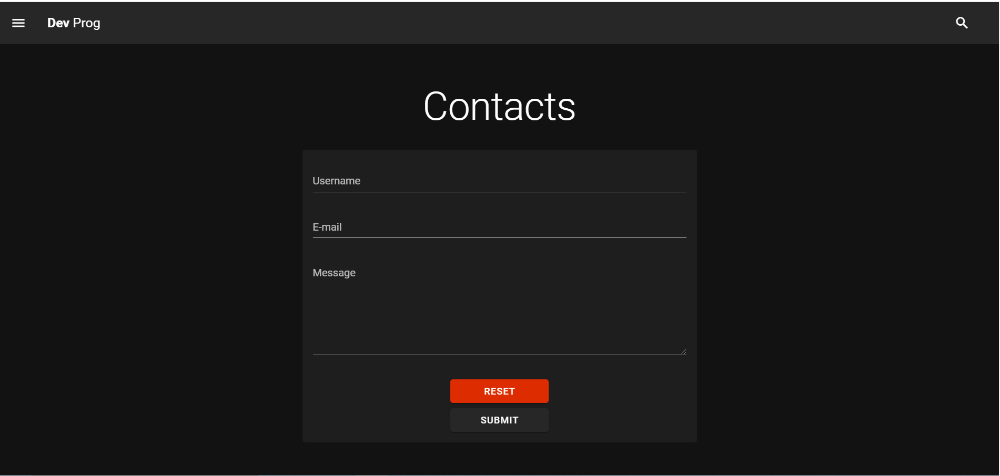

# DEV_PROG
I have decided to create an app, where I can create my own blog.


Home Page


Contacts page

## Technologies
* Python/Django
* Vue js
* Nuxt js

## How to run the app
In the terminal, type the following:
```
cd server
python manage.py migrate
python manage.py runserver
```
In the separate terminal
```
npm install
npm run build
npm run dev
```

`Warning! The app is under development. So do not clone it`
